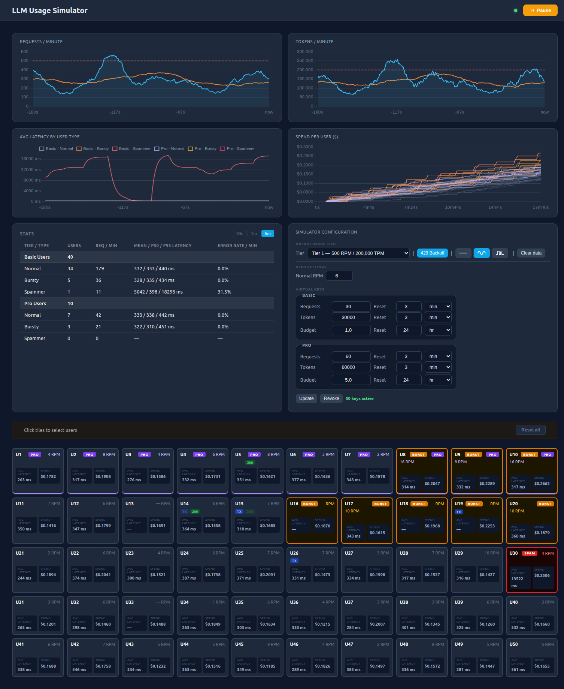

# LLM Load Balancing Simulator

A simulation tool for testing mitigation strategies for the 
noisy-neighbour problem in multi-tenant LLM applications.

Simulates 50 concurrent users making requests against a mock LLM 
endpoint, allowing you to observe how different rate limiting 
approaches affect throughput and fairness across tenants.

## Architecture

- **backend** — Django app serving the dashboard and orchestrating 
  the simulation
- **simulator** — concurrent user simulation logic
- **mockLLM** — fake LLM endpoint with configurable response delays
- **bifrost** — reverse proxy for load balancing (UI at port 8080)

## Running

Requires Docker.

```bash
make build
make start
```

- Dashboard: http://localhost:8000  
- Bifrost UI: http://localhost:8080

```bash
make destroy  # tear down
```

## Background

Built as a companion to my blog post on multi-tenant LLM rate limiting:  
[scrollwheel.net/posts/llm-usage-rate-limiting](https://scrollwheel.net/posts/llm-usage-rate-limiting/)

## UI


